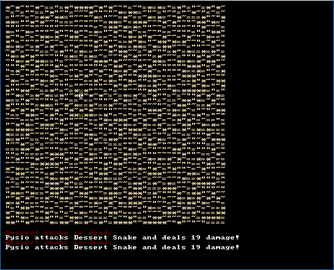

# MirageRL



Roguelike that takes place on a dessert.
Currently there are a few monsters to fight and a boring, but persistent map to walk.

**Note** Sometimes there is a chance that enemies will not spawn.

## Dependencies
`pip install tcod==11.6.0`

## Run from script
`python main.py`

## Controls

```
Arrows or vi keys to move

ESC to quit without saving

S to save
```
